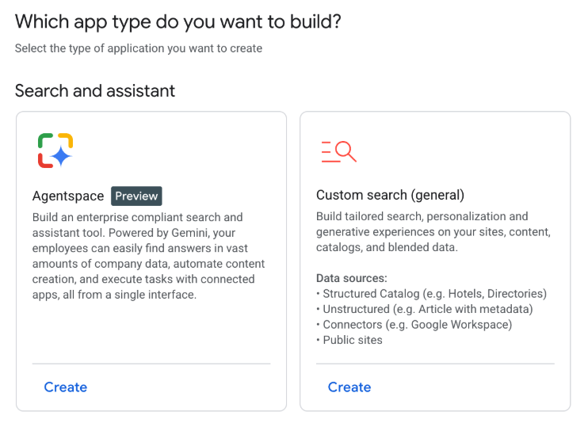
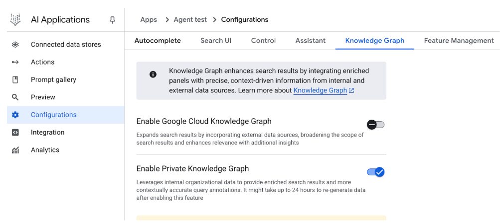

# Appendix D - Building an Agent with AgentSpace

## Overview

AgentSpace is a platform designed to facilitate an "agent-driven enterprise" by integrating artificial intelligence into daily workflows. At its core, it provides a unified search capability across an organization's entire digital footprint, including documents, emails, and databases. This system utilizes advanced AI models, like Google's Gemini, to comprehend and synthesize information from these varied sources.

The platform enables the creation and deployment of specialized AI "agents" that can perform complex tasks and automate processes. These agents are not merely chatbots; they can reason, plan, and execute multi-step actions autonomously. For instance, an agent could research a topic, compile a report with citations, and even generate an audio summary.

To achieve this, AgentSpace constructs an enterprise knowledge graph, mapping the relationships between people, documents, and data. This allows the AI to understand context and deliver more relevant and personalized results. The platform also includes a no-code interface called Agent Designer for creating custom agents without requiring deep technical expertise.

Furthermore, AgentSpace supports a multi-agent system where different AI agents can communicate and collaborate through an open protocol known as the Agent2Agent (A2A) Protocol. This interoperability allows for more complex and orchestrated workflows. Security is a foundational component, with features like role-based access controls and data encryption to protect sensitive enterprise information. Ultimately, AgentSpace aims to enhance productivity and decision-making by embedding intelligent, autonomous systems directly into an organization's operational fabric.

## How to build an Agent with AgentSpace UI

Figure 1 illustrates how to access AgentSpace by selecting AI Applications from the Google Cloud Console.

Fig. 1:  How to use Google Cloud Console to access AgentSpace

Your agent can be connected to various services, including Calendar, Google Mail, Workaday, Jira, Outlook, and Service Now (see Fig. 2).

Fig. 2: Integrate with diverse services, including Google and third-party platforms.

The Agent can then utilize its own prompt, chosen from a gallery of pre-made prompts provided by Google, as illustrated in Fig. 3\.

Fig.3: Google's Gallery of Pre-assembled  prompts

In alternative you can create your own prompt as in Fig.4, which will be then used by your agent  

Fig.4: Customizing the Agent's Prompt

AgentSpace offers a number of advanced features such as integration with datastores to store your own data, integration with Google Knowledge Graph or with your private Knowledge Graph, Web interface for exposing your agent to the Web, and Analytics to monitor usage, and more (see Fig. 5\)

Fig. 5: AgentSpace advanced capabilities

Upon completion, the AgentSpace chat interface (Fig. 6\) will be accessible.

Fig. 6: The AgentSpace User Interface for initiating a chat with your Agent.

## Conclusion

In conclusion, AgentSpace provides a functional framework for developing and deploying AI agents within an organization's existing digital infrastructure. The system's architecture links complex backend processes, such as autonomous reasoning and enterprise knowledge graph mapping, to a graphical user interface for agent construction. Through this interface, users can configure agents by integrating various data services and defining their operational parameters via prompts, resulting in customized, context-aware automated systems.

This approach abstracts the underlying technical complexity, enabling the construction of specialized multi-agent systems without requiring deep programming expertise. The primary objective is to embed automated analytical and operational capabilities directly into workflows, thereby increasing process efficiency and enhancing data-driven analysis. For practical instruction, hands-on learning modules are available, such as the "Build a Gen AI Agent with Agentspace" lab on Google Cloud Skills Boost, which provides a structured environment for skill acquisition.

## References

1. Create a no-code agent with Agent Designer, [https://cloud.google.com/agentspace/agentspace-enterprise/docs/agent-designer](https://cloud.google.com/agentspace/agentspace-enterprise/docs/agent-designer)
2. Google Cloud Skills Boost, [https://www.cloudskillsboost.google/](https://www.cloudskillsboost.google/)
